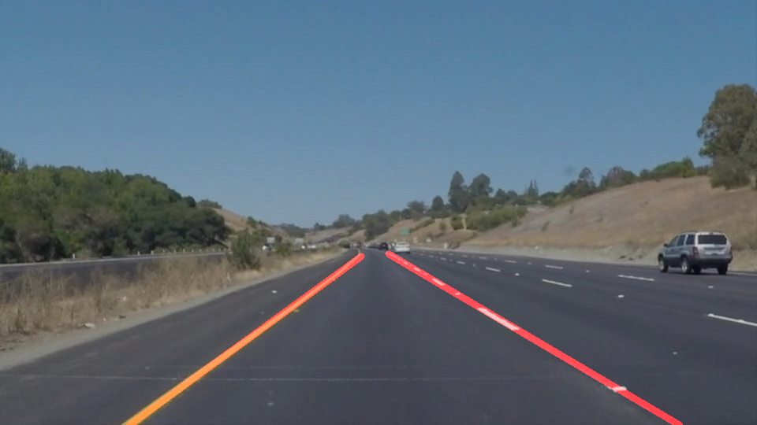

# **Finding Lane Lines on the Road** 

---

**Finding Lane Lines on the Road**

The goals / steps of this project are the following:
* Make a pipeline that finds lane lines on the road
* Reflect on your work in a written report

---

# Reflection

## 1. Describe the pipeline. 

My pipeline consists of 5 steps. 
### Step 1. Use Gaussian kernel for smoothing to reduce noise 
 
### Step 2. Apply canny edge detection using gradients

### Step 3. Define a four sided polygon to mask 
The polygon vertices is automatically adapted to different size of images / videos
### Step 4. Run Hough on edge detected image to find lines
### Step 5. Connect detected lines by applyingn the following steps|  
* remove near horizental lines
* use position and slope signs to seperate left and right lanes
* only consider lines with slope difference <=0.1 from the longest line
* calculate weighted average (weighted by line length) slope and intercept of the longest 5 lines
* get the coordinates of the final connected line

### Step 6. Draw lines onto image using weighted sum of original image and a blank image with detected lines on it

## 2. Result
Test Images:

solidWhiteCurve | solidWhiteRight 
 :---:|:---:  
 | 

solidYellowCurve2 | solidYellowCurve
 :---:|:---:  
 | 

solidYellowLeft | whiteCarLaneSwitch
 :---:|:---:  
 | 

Test Videos:
solidWhiteRight | solidYellowLeft | challenge
 :---:|:---:|:---:  
 |  | 

## 3. Identify potential shortcomings with your current pipeline
* There're still some problems for the challenge video. For example:
* It doesn't work well with curve lanes 
* When the lane is not easily detected in some bad weather, the algorithm will not work well
* When it is sparse dotted lanes or the longer lines are too far away and the car is turning right or left, the prediction will be off
* When the lighting condition changes, it might not work very well

## 4. Suggest possible improvements to your pipeline
* Can develop a function that can memorize the lane in the last clip so that when it is not easy to detect lane in current clip, we can use the previous one as a reference or baseline. Also if the slope changes too much, it can also help make modification
* Instead of linear functions, use curve fitting
* Automatically adapt to different lighting conditions 
